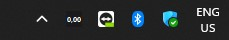

# OpenRouter Budget Tray Icon (.NET / C#)

Native Windows 11 system tray icon showing your OpenRouter credits and daily spend. Single self-contained `.exe`, no install needed.

## Features

- Remaining budget + today's spend shown directly in the tray
- Hover tooltip with full breakdown (remaining / today / weekly / monthly)
- Right-click: today / week / month / last 7 days
- 30-day spend history with bar chart dashboard
- Auto-refreshes every 2 minutes
- Single instance (no duplicates)
- Auto-start on boot

## Download

Grab the latest `.exe` from [Releases](../../releases) — no .NET SDK needed.

To auto-start with Windows: run `install_autostart.bat`.

## Get Your API Key

https://openrouter.ai/settings/keys → create a key → paste in `config.json`

## Files

| File | Purpose |
|---|---|
| `build.bat` | Compile to single `.exe` |
| `install_autostart.bat` | Add to Windows Startup |
| `uninstall_autostart.bat` | Remove from Startup |
| `config.json` | API key (created on build) |
| `history.json` | Daily spend log (auto-generated) |
| `dashboard.html` | 30-day chart (auto-generated) |
